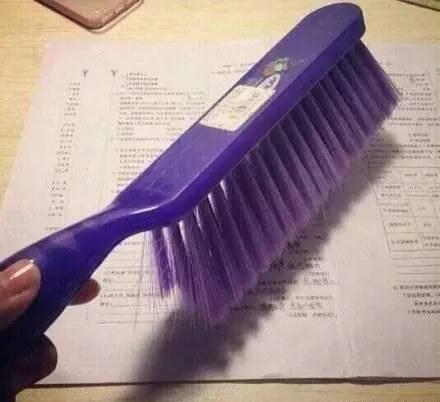

## Leetcode力扣！！！
Leetcode的个人思考的一些记录，做一个“刷”题的记录子。

## 刷题过程

一刷二月中旬到四月中旬做过二百来道题，但是基本上就是自己做easy题，大部分medium题目都是草草看了答案 （一般刷题不建议做hard？），然后便是暂停了半个月，现在偶尔回顾时根本不记得自己抄过的题目。啊西吧，看不懂。

根据费曼学习法，为了更好地理解刷，就是解释给别人能让他们听得懂，那就开个博客记录下吧，虽然很大可能看也没人看，嘻嘻。⛽️。如果各位大佬有发现出入或者任何不合适的地方，请issue.❤️

五月： Array 

[11. Container with Most Water](./Array/11.Container_with_Most_Water.md)

## 资源

记录自己刷Leetcode的同时，分享些参考过的资源。

刷题经验贴：

[给新手的刷题经验贴](https://www.1point3acres.com/bbs/thread-503275-1-1.html)

解题分类：

[Leetcode分类顺序](https://cspiration.com/leetcodeClassification#10301)

别的Leetcode解题github/blog：

[Leetcode Animation：用动画来演示解题思路](https://github.com/MisterBooo/LeetCodeAnimation)

[Leetcode题解](https://github.com/azl397985856/leetcode)

